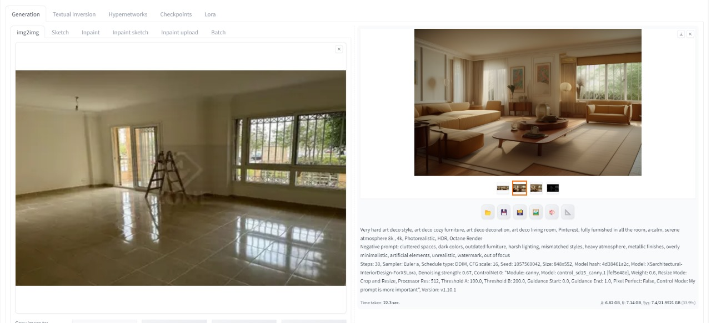
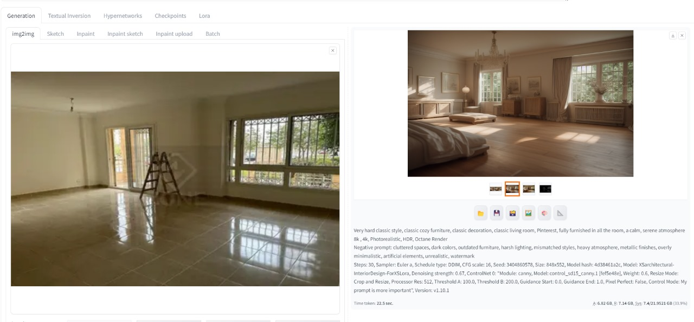
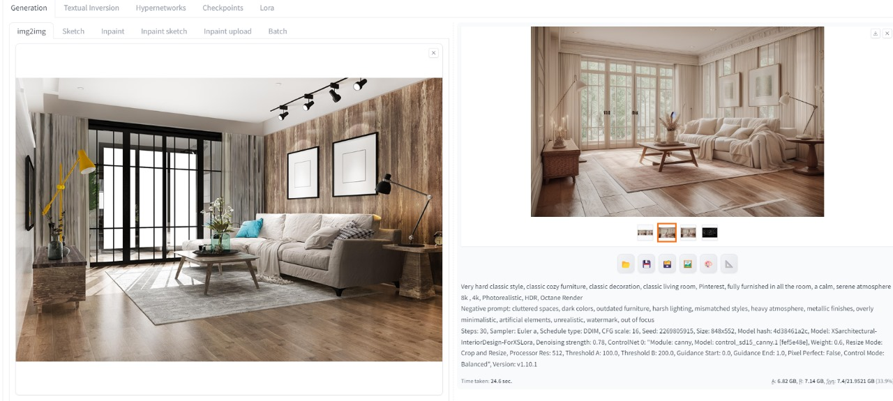
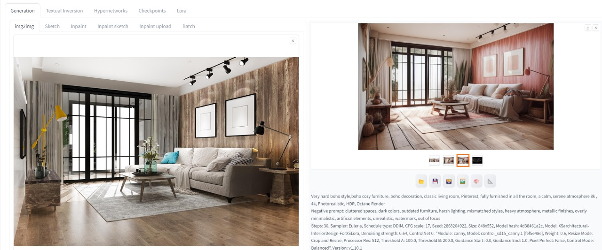
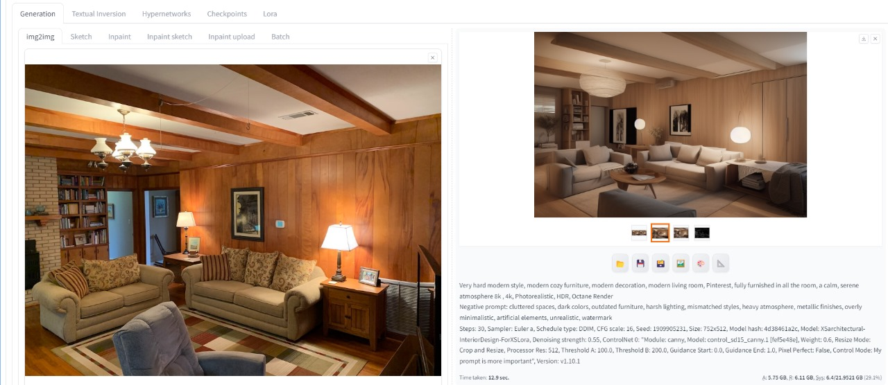
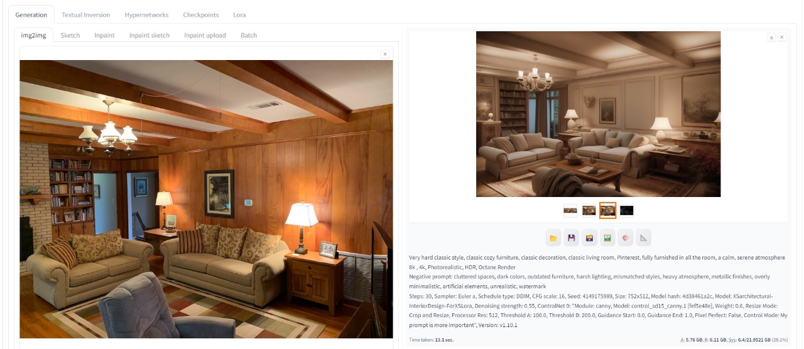
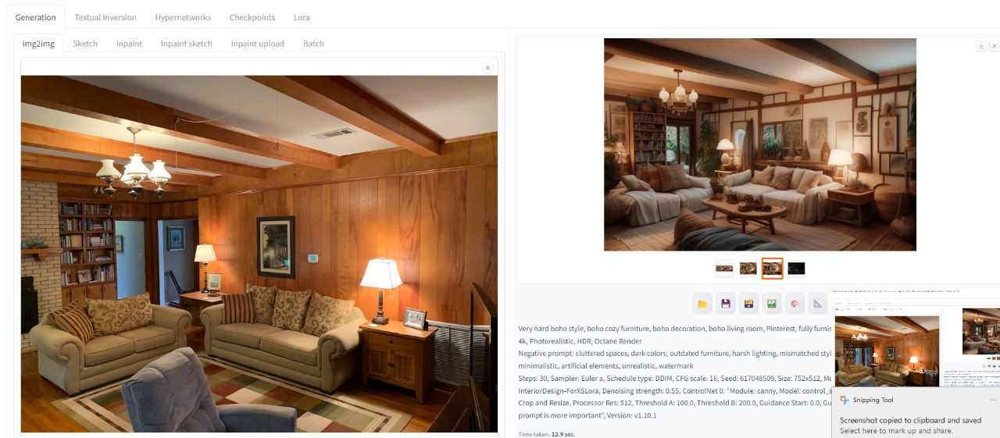

# aldesigner.io - AI-Powered Interior Design Platform

Welcome to **aldesigner.io**, an AI-powered interior design platform that revolutionizes the way you envision, plan, and redesign spaces. Using cutting-edge AI technology, the platform enables users to generate personalized interior designs by selecting styles, room types, and themes. Whether you're a professional interior designer or a homeowner looking to refresh your living space, `aldesigner.io` is here to bring your ideas to life.

## Sample Designs

Here are some sample room designs generated by `aldesigner.io`:


*Turning an empty room to a midcenture living room.*


*Turning an empty room to a art deco living room.*


*Turning an empty room to a classic living room.*


*Transforming a designed living room from modern to classic one.*


*Transforming a designed living room from modern to Boho one.


*Transforming a real old rustic traditional living room modern style. *


*Transforming a real old rustic traditional living room classic style.*


*Transforming a real old rustic traditional living room Boho style..*

## Key Features

- **AI-Driven Design Generation**: Instantly generate interior design ideas tailored to your preferences, including styles (e.g., modern, classic) and room types (e.g., bedroom, bathroom).
- **Image-to-Image Transformation**: Use advanced machine learning techniques, including Canny edge detection and Stable Diffusion, to transform your existing room photos into new design concepts.
- **Customizable Prompts**: Adjust parameters like design prompts, guidance scale, strength, steps, and more to fine-tune the generated images.
- **Responsive and Scalable**: Built on FastAPI, ensuring a responsive user experience and easy scalability for large-scale usage.
- **Seamless Integration**: Designed for integration with other tools and platforms, making it easier to incorporate into your existing design workflows.

## How It Works

1. **Upload a Room Image**: Start by uploading a photo of the room you want to redesign.
2. **Select Your Preferences**: Choose the style, theme, and other design elements you prefer.
3. **Generate Your Design**: Let the AI process the image and generate a new design based on your inputs.
4. **Review and Refine**: View the AI-generated designs and make adjustments as needed.
5. **Download or Share**: Once satisfied, download the design or share it directly with others.

## Installation

To set up and run the `aldesigner.io` backend locally, follow these steps:

### Prerequisites

- **Python**: Make sure Python 3.8 or higher is installed on your system.
- **Pip**: Ensure pip, the Python package manager, is available.

### Steps

1. **Clone the Repository**:

    ```bash
    git clone https://github.com/your-username/aldesigner-io-backend.git
    cd aldesigner-io-backend
    ```

2. **Install Dependencies**:

    Install the required Python packages using pip:

    ```bash
    pip install -r requirements.txt
    ```

3. **Run the Server**:

    Start the FastAPI server:

    ```bash
    uvicorn main:app --host 0.0.0.0 --port 8000 --reload
    ```

4. **Access the Application**:

    Open your web browser and go to `http://localhost:8000/docs` to view the API documentation and test the endpoints.

## API Endpoints

### `POST /generate-image/`

Generates a new interior design based on the input image and design preferences.

- **Request Body**:
    ```json
    {
      "image_url": "https://example.com/room.jpg",
      "prompt": "A modern living room with minimalist furniture",
      "negative_prompt": "dark colors, cluttered space",
      "schedule_type": "DDIM",
      "guidance_scale": 7,
      "strength": 0.75,
      "steps": 50,
      "seed": 42,
      "threshold1": 100.0,
      "threshold2": 200.0,
      "ai_slider": 1.0
    }
    ```
- **Response**:
    Returns a JSON object containing a base64-encoded image of the generated design.

### Example Usage

To use the API, you can send a `POST` request to the `/generate-image/` endpoint with the desired parameters. Below is an example using `curl`:

```bash
curl -X POST "http://localhost:8000/generate-image/" -H "Content-Type: application/json" -d '{
  "image_url": "https://example.com/room.jpg",
  "prompt": "A futuristic living room",
  "negative_prompt": "blurry, low-quality",
  "schedule_type": "DDIM",
  "guidance_scale": 7,
  "strength": 0.75,
  "steps": 50,
  "seed": 42,
  "threshold1": 100.0,
  "threshold2": 200.0,
  "ai_slider": 1.0
}'
